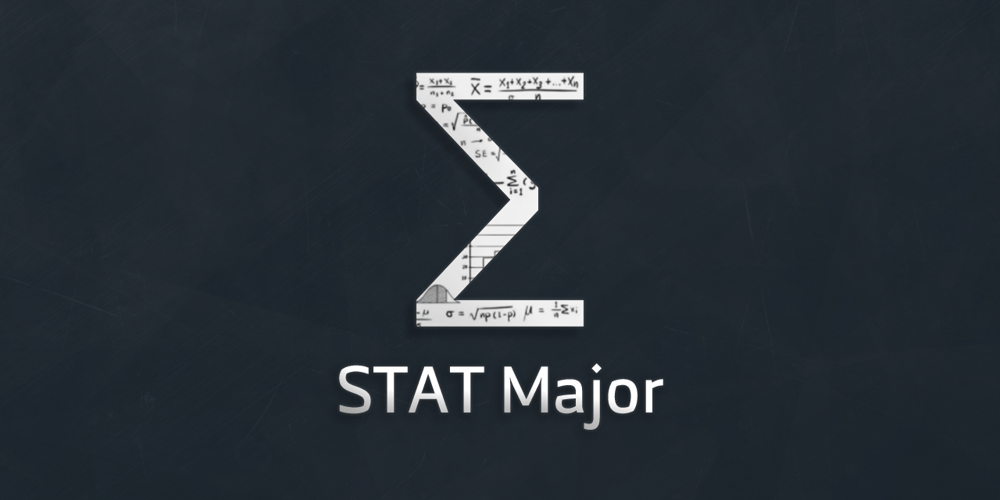

This website will orginaizy all statistcs major subjects and thier content (Notes, Past exams, etc...)
I'll create admin system to add and remove subjects and pages.

### Project map:
    
    STAT_Major
    ├── config          # Store the configuration file such as database configuration
    │  └── config.php   # All configuration
    │
    ├── download        # Files can anyone download it 
    ├── media           # Contain only media files (.png, .jpg, .jpeg, .mp4, etc...)
    ├── public          # Store the public files accessed directly by the users
    │  ├── index.php    # Home page
    │  └── subject.php  # This page will display all subject stored in database 
    │
    ├── src             # Store the source files that should not be exposed to the public
    │  ├── inc          # Store the commonly included files such as the header and footer of a page
    │  │  ├── js                # Store all javascript files
    │  │  ├── webfonts          # For icons
    │  │  └── css               # Store all css files
    │  │
    │  └── libs         # Store the library files, e.g., validation, sanitization, etc.
    │     ├── connection.php    # Contain all database function (such as connect, select, etc...)
    │     └── subjects.php      # Contain all functions used subject page in public folder.
    │
    ├── .htaccess
    └── README.me
